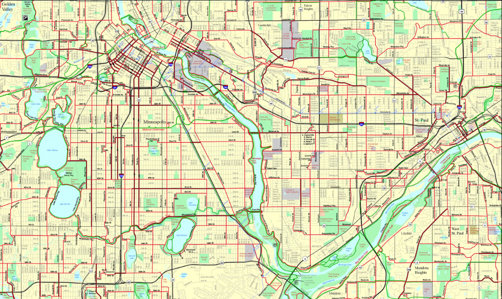

# Metro Transit API Project 

This is a Python and TKinter GUI application that displays timetables for Metro Transit buses. 

## Installation instructions 

Todo 

## How to use 

V. short user manual 

Screenshots of app running

