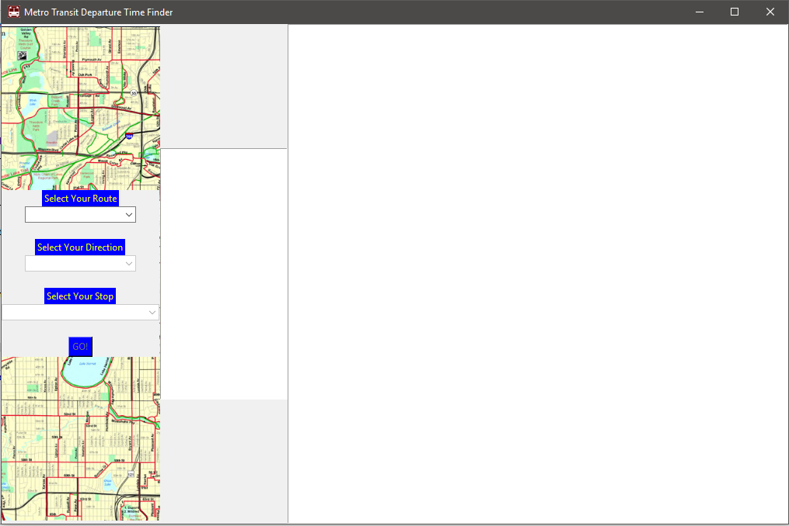
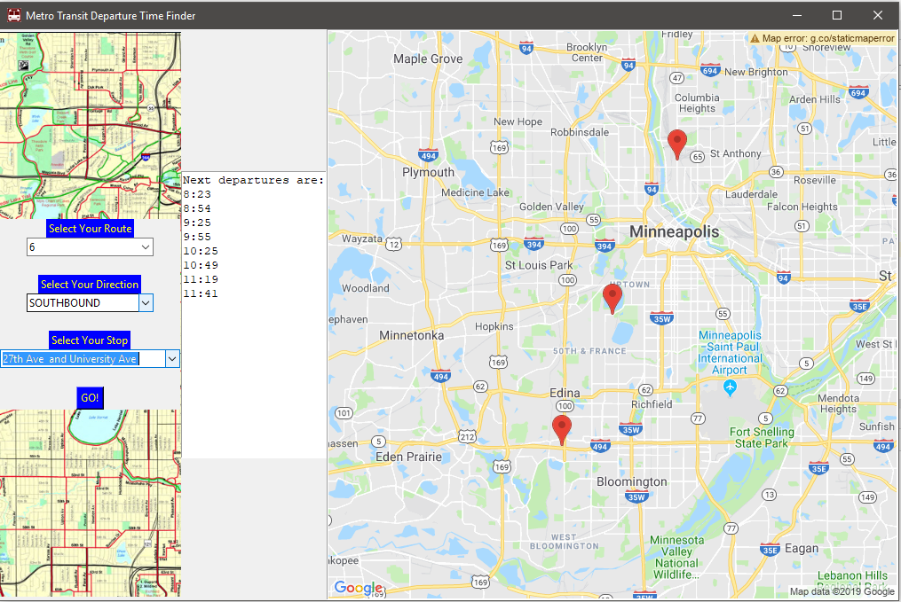

# Metro Transit API Project 

This is a Python and TKinter GUI application that displays timetables for Metro Transit buses and trains. 

## Installation instructions
Get an api key from the Google Maps Static Map API at https://developers.google.com/maps/documentation/maps-static/intro. Then create an environment variable called "GoogleMapsKey" and put your api key in there.
Check the requirements.txt file to install all dependencies
 

## How to use 
The use if pretty straight forward because it only allows you to use the app in its intended order.
First select the route you want to travel on, select the direction you need to go in, then select the stop you wish to depart at, and finally hit the "Go!" button to get your departure times and a map of your selected route.

## Screenshots
Screenshots of app running

Program starting look

Program results

